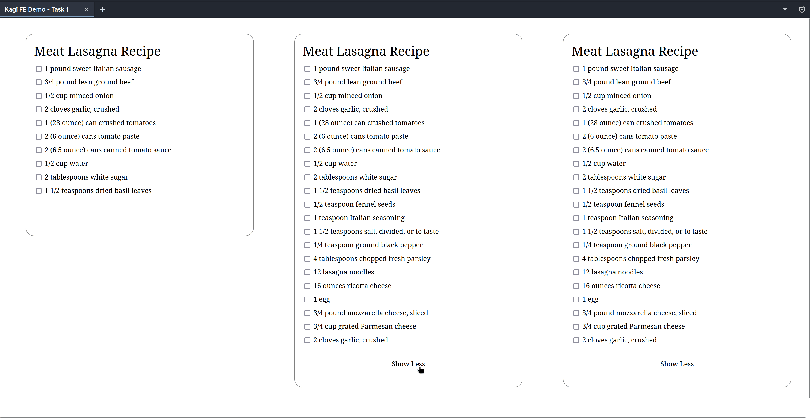
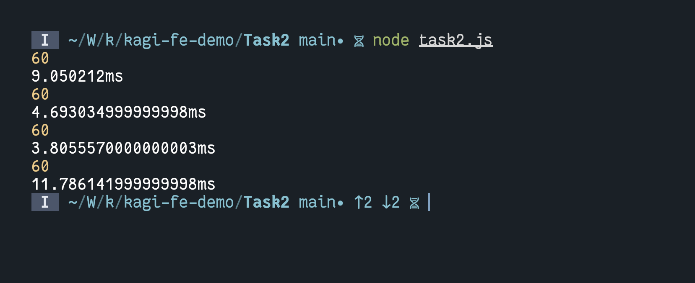

# Table of Contents

1.  [KAGI Fe Demo](#org96e7e2e)
    1.  [Task 1](#org321cc1e)
    2.  [Task 2](#orgd34cb51)

# KAGI Fe Demo

## Task 1

Two examples (example1.html, example2.html) of the first task can be found in the Task1 directory. They should work in a browser of your choice; they don&rsquo;t use any JavaScript.
For the second example, I tried to figure out a way which would allow me to show the &rsquo;Show More&rsquo; button,
based on whether the text within the element above it had more than 10 lines but couldn&rsquo;t find one.
So I had to rely on making each line of the text an individual element within the DOM to make it work.

## Task 2

A script for the second task (task2.js) can be found in the Task2 directory. It contains of four implementations of the court method with a benchmark. The first one is how I would code it in practice. The third one was the fastest on my machine ( Ryzen 7 7700, 32 GB DDR5 6000C40 memory). It relies on the built in string split method and a raw for loop.
I tried sorting the array and using binary search in the fourth implementation but that was consistently slower. Regular expressions are generally slower than built-in string methods
so I didn&rsquo;t bother with them.

